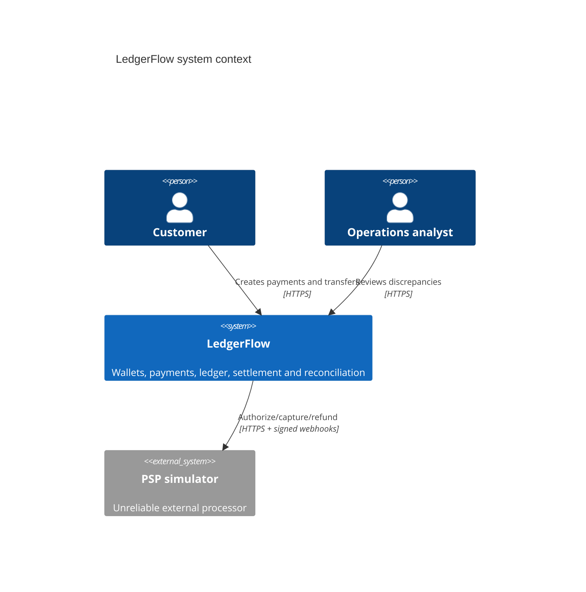
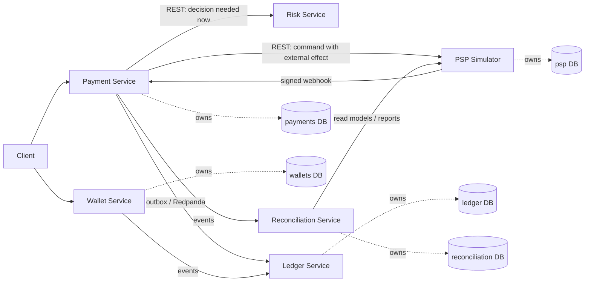

# Architecture

Status: current.

LedgerFlow separates decisions about a payment from the immutable accounting evidence that money moved. Payment orchestrates; Wallet controls spendable funds; Ledger records balanced journals; the PSP is an unreliable external truth; Reconciliation compares those truths later.

## Communication choices

- REST is used when the caller cannot proceed without a decision: risk evaluation and PSP commands. Both have timeouts, and timeout means unknown for PSP money movement.
- Events are used for facts that other bounded contexts react to independently: payment captured, ledger posted, mismatch detected. They are at-least-once and require inbox deduplication.
- gRPC is intentionally absent. The learning benefit does not currently justify an additional interface technology; typed REST and events expose the relevant trade-offs.

## Database ownership

No service may query another service's tables. Compose uses one PostgreSQL server for local cost, but creates separate databases and credentials should be split in a hardened deployment. Cross-service identifiers are plain UUIDs, never foreign keys.

## Current implementation boundary

The Payment-to-Ledger vertical slice is durable in the Compose runtime: Payment writes PostgreSQL state, operation history, webhook inbox, and outbox intent; the PSP stores idempotent operations and webhook deliveries in its own PostgreSQL database; the Payment worker publishes to Redpanda; and Ledger consumes capture/refund events through a PostgreSQL inbox transaction. See [payment-flow.md](payment-flow.md) and [outbox-inbox.md](outbox-inbox.md). In-memory adapters remain for deterministic unit tests. Other bounded contexts retain their earlier learning adapters; this iteration does not claim system-wide production readiness.
