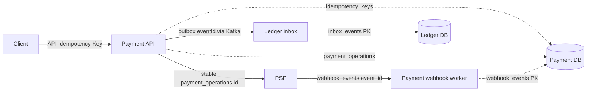

# Idempotency boundaries

Status: all four payment lifecycle boundaries are durable.

These controls are not interchangeable:

| Boundary | Identity | Prevents |
|---|---|---|
| Client → create Payment | caller `Idempotency-Key` + canonical request hash | duplicate payment creation |
| Client → capture/refund | caller key + operation request hash | duplicate logical capture/refund |
| Payment → PSP | durable `payment_operations.id` sent as PSP idempotency key | duplicate provider effect after retry/lost response |
| PSP → Payment webhook | stable external `eventId` in `webhook_events` | duplicate callback side effect |
| Kafka → Ledger | integration `eventId` in `inbox_events` | duplicate journal after outbox/Kafka redelivery |

Same API key and same hash replay the stored result. Same key with another body fails explicitly. Capture and every partial refund use distinct caller keys and distinct durable operation IDs. Operation retry increments `attempt_count` but does not replace the operation ID.

Retention must exceed the longest API, provider, webhook, Kafka, and recovery retry horizon. Deleting a key while an old request can still reappear reopens the duplication window. This learning implementation does not yet implement archival/retention jobs.

Implementation: `payment.application.ts`, `postgres-payment.repository.ts`, migration `0003_payment_lifecycle.sql`, PSP `postgres-psp.repository.ts`, and Ledger `postgres-ledger.repository.ts`.
