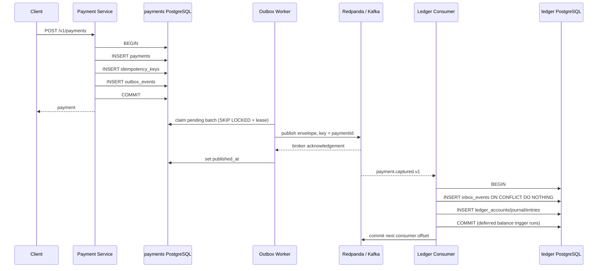

# Transactional outbox and inbox

Status: wired and integration-tested for Payment -> Ledger.

## Runtime sequence



The payment transaction is `PostgresPaymentRepository.create` in `apps/payment-service/src/postgres-payment.repository.ts`. Its payment row, idempotency record, and `payment.created.v1` outbox envelope share one Drizzle transaction. State transitions use the same rule: update the payment and insert the corresponding outbox row before commit.

The Ledger transaction is `PostgresLedgerRepository.processPaymentCaptured` in `apps/ledger-service/src/postgres-ledger.repository.ts`. The inbox insert, account creation, journal, and two entries commit together. A conflict on `inbox_events.event_id` returns `DUPLICATE` before any financial write. `KafkaLedgerConsumer` commits the Kafka offset only after that database transaction returns.

## Why Kafka is not inside the database transaction

PostgreSQL and Kafka are independent commit coordinators. A normal application transaction cannot atomically commit both, and this project deliberately avoids distributed two-phase commit. Publishing before the database commit can expose an event for state that later rolls back. Publishing after commit can lose the event if the process crashes between those operations. The outbox turns the second operation into recoverable work: the committed row is durable publication intent.

## Publisher lifecycle and polling

`OutboxWorker` in `apps/payment-service/src/outbox.worker.ts` starts with the Payment process and stops during Nest shutdown. Every 500 ms it asks `PostgresOutboxStore.claimBatch` for up to 50 rows. The claim is one SQL statement using `FOR UPDATE SKIP LOCKED`; it sets `locked_at` and `locked_by`, so multiple workers do not normally publish the same row concurrently. A 30-second lease makes abandoned claims eligible after a worker crash.

For each claimed row, `OutboxPublisher`:

1. sends the serialized event envelope to `ledgerflow.payments.v1`, keyed by `aggregate_id`;
2. waits for Kafka acknowledgement (`acks=-1`);
3. sets `published_at` only after acknowledgement;
4. on failure, increments `attempts`, records `last_error`, clears the lease, and schedules exponential jittered retry;
5. after eight attempts, moves the payload to `dead_letter_events` and marks the outbox row dead-lettered.

The worker and all pending rows survive process restarts because state lives in PostgreSQL. A broker outage leaves rows pending/retryable.

## The intentional duplicate window

```mermaid
sequenceDiagram
  participant W1 as Worker before crash
  participant K as Kafka
  participant DB as payments DB
  participant W2 as Restarted worker
  participant L as Ledger
  W1->>K: publish event E
  K-->>W1: accepted
  Note over W1: process crashes
  Note over DB: E still has published_at = NULL and an expiring lease
  W2->>DB: reclaim E after lease expiry
  W2->>K: publish event E again
  K-->>L: E (first copy)
  L->>L: inbox claim + journal commit
  K-->>L: E (duplicate)
  L->>L: inbox conflict; no financial writes
```

There is no safe ordering that removes this window without a cross-system transaction. Marking first could lose an event; publishing first can duplicate it. Ledger therefore makes duplicate side effects harmless with its durable inbox. The honest end-to-end guarantee is at-least-once delivery with effectively-once financial application per `eventId`, not Kafka/database exactly-once delivery.

## Contract and storage

`packages/contracts/src/index.ts` defines the envelope and strict `paymentCapturedEventSchema`: `eventId`, `eventType`, `eventVersion`, `occurredAt`, `correlationId`, optional `causationId`, `aggregateId`, and a payload containing payment, wallet, merchant, status, amount, and currency. Including Ledger's required identifiers in the fact preserves database ownership; Ledger never queries the payments database.

Relevant migrations are `apps/payment-service/migrations/0001_payment.sql`, `0002_outbox_leases.sql`, `apps/ledger-service/migrations/0001_ledger.sql`, and `0002_inbox_and_balance.sql`.
