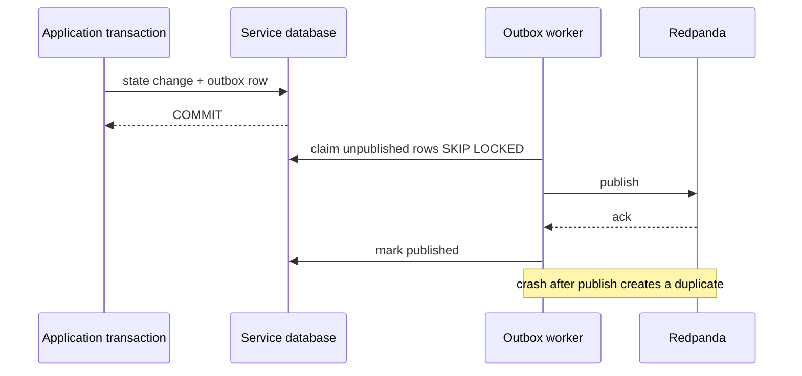

# Transactional outbox and inbox

Status: schema and algorithms implemented; background scheduling not wired.

Payment writes business state and an outbox row in the same local database transaction. Publishing directly to Kafka inside that transaction is unsafe: Kafka may accept while PostgreSQL rolls back, or PostgreSQL may commit while publishing fails. No transaction spans both systems.

`OutboxPublisher` retries with exponential jitter, caps attempts, then dead-letters. Duplicates are expected if it crashes after broker acknowledgement and before marking published. `IdempotentConsumer` claims the `eventId`; on handler failure it releases the claim so redelivery can retry. In PostgreSQL the inbox claim and domain effect must be one transaction—an adapter must not implement them as separate commits.
