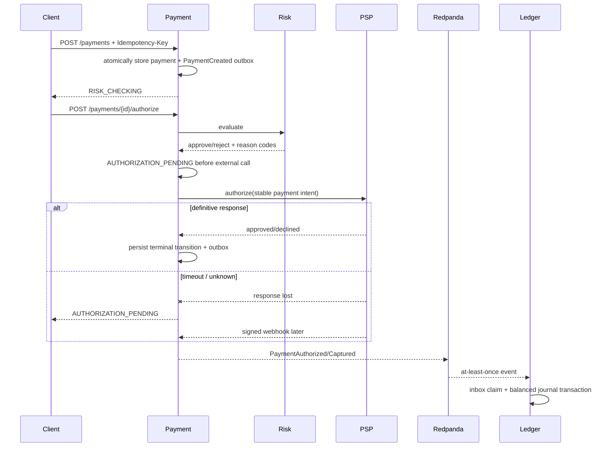
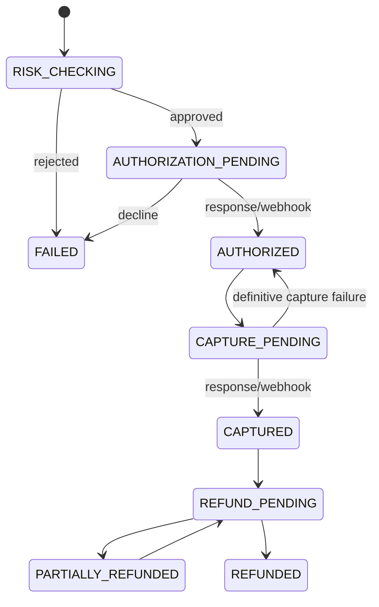

# Payment flow

Status: current.

Implementation: `apps/payment-service/src/payment.application.ts`. A timeout never proves failure; blind retry could double-charge. The stable internal payment ID is the PSP intent identity, so the simulator deduplicates retried operations.
