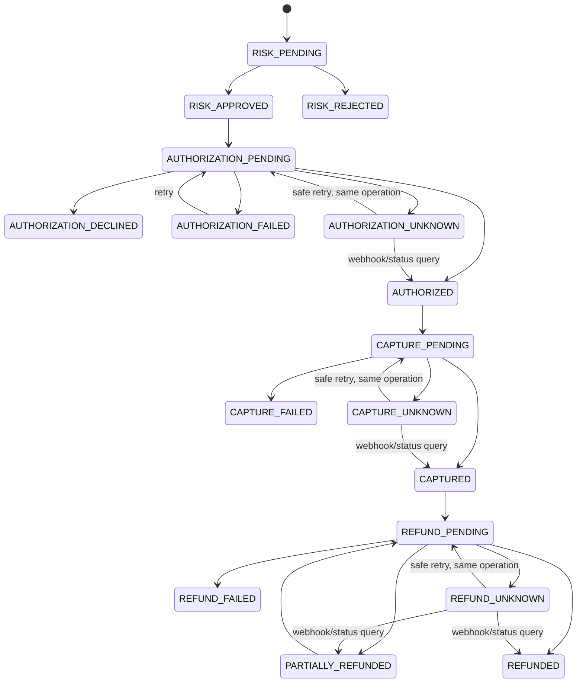
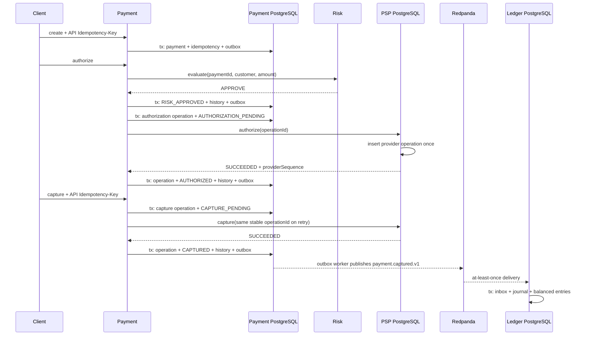
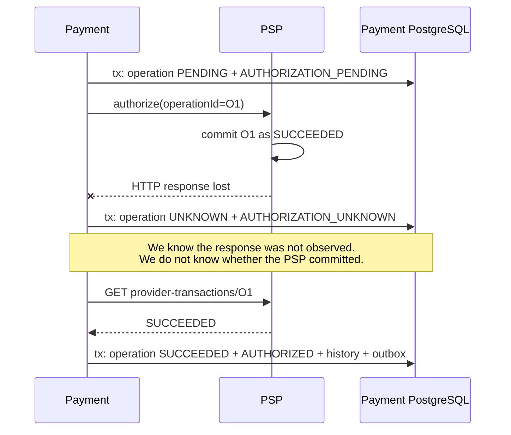
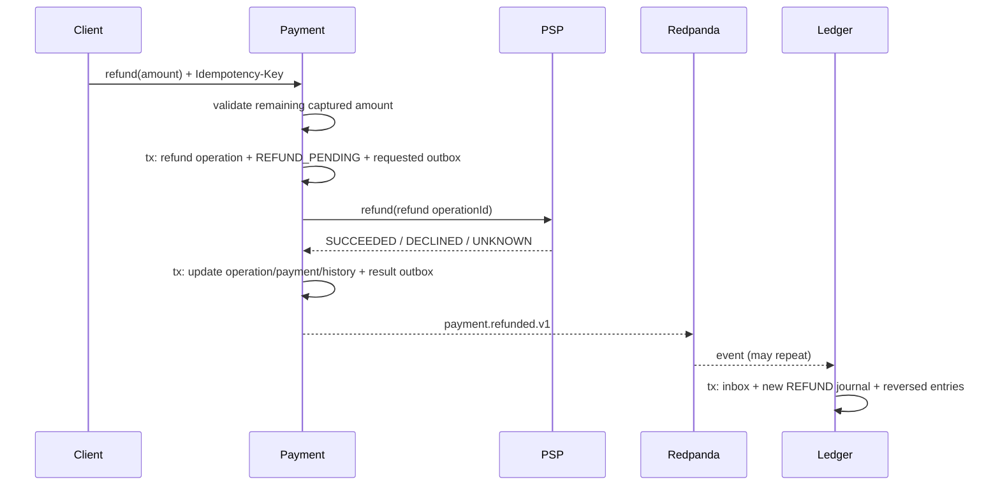

# Payment lifecycle and orchestration

Status: current for Iteration 3.

Payment Service is the workflow orchestrator. Risk owns a deterministic approve/reject decision, the PSP owns external authorize/capture/refund records, and Ledger owns immutable accounting. Risk and PSP commands are synchronous because Payment needs an immediate answer; PSP webhooks and Payment-to-Ledger events are asynchronous because delivery is delayed and at-least-once.

## State machine

All transitions pass through `payment-state-machine.ts`; repositories reject invalid changes and PostgreSQL also constrains the set of stored statuses. Terminal states are `RISK_REJECTED`, `AUTHORIZATION_DECLINED`, `REFUNDED`, and `CANCELLED`. `AUTHORIZATION_UNKNOWN`, `CAPTURE_UNKNOWN`, and `REFUND_UNKNOWN` require recovery. Failure states may be retried with the same logical operation where allowed.



## Happy authorize and capture



Risk rejection ends at `RISK_REJECTED` and no PSP operation is created. A PSP decline is a normal `AUTHORIZATION_DECLINED` business result. A provider HTTP 5xx with no accepted operation is `AUTHORIZATION_FAILED`. A timeout or network loss is `AUTHORIZATION_UNKNOWN` because the external effect may exist.

## PSP succeeds but the response is lost



`TIMEOUT != FAILURE`. Payment stores uncertainty rather than inventing a negative result. Recovery queries by the original operation ID. If the PSP says `NOT_FOUND`, retry is safe only because the retry reuses that same ID. A new ID would be a new financial intent and could double-charge.

## Webhook-before-response race

```mermaid
sequenceDiagram
  participant P as HTTP request
  participant X as PSP
  participant W as Webhook worker
  participant D as Payment PostgreSQL
  P->>X: capture(operationId=O2)
  X->>W: signed CAPTURED webhook
  W->>D: tx: lock operation/payment, mark O2 SUCCEEDED, CAPTURED, outbox
  X-->>P: HTTP SUCCEEDED
  P->>D: lock O2; already SUCCEEDED, return current payment
  Note over P,D: The late HTTP result cannot overwrite the newer state.
```

Both paths lock the operation and payment rows in the same order. Operation terminality, provider sequence, the state machine, and optimistic payment version prevent regression.

## Refund



Partial refunds are supported sequentially; `refundedAmountMinor` may never exceed `capturedAmountMinor`. Refunds append new debit/credit entries and link to the original capture journal. Historical entries are never edited.

## Important atomic and concurrency boundaries

- `create`: payment, client idempotency record, initial history, and outbox event commit together.
- `beginOperation`: durable operation, pending payment state, history, and optional requested event commit together before the PSP call.
- `resolveOperation`: provider outcome, payment state, history, and integration outbox commit together.
- `processWebhook`: webhook status, operation result, payment state, history, and outbox commit together.
- Ledger: Kafka inbox, journal, and entries commit together.
- External PSP HTTP cannot share a database transaction with Payment. Stable operation IDs plus query/webhook recovery bridge that unavoidable gap.

Implementation entry points: `apps/payment-service/src/payment.application.ts`, `payment-state-machine.ts`, `postgres-payment.repository.ts`, `recovery.worker.ts`, `apps/psp-simulator/src/postgres-psp.repository.ts`, and `apps/ledger-service/src/postgres-ledger.repository.ts`.
