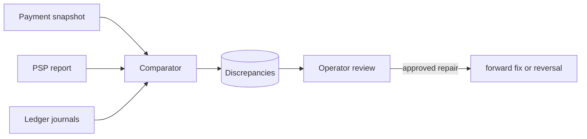

# Reconciliation

Status: comparison engine and schema implemented.

Reconciliation compares three independent views over a time window: Payment lifecycle, PSP operations, and Ledger journals. It detects PSP success while internal state is pending, internal capture missing at PSP, amount mismatch, duplicate external transactions, and missing ledger journals.

Repair is intentionally manual-first. The system should never silently invent a ledger entry or reverse a processor charge from ambiguous evidence. Resolution records need actor, note, timestamps, and links to any compensating action. Tests live in `tests/reconciliation.test.ts`.
