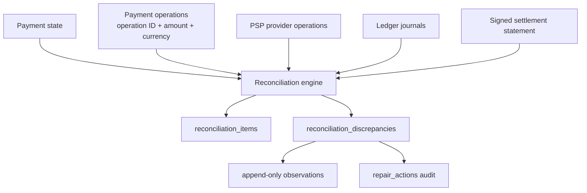
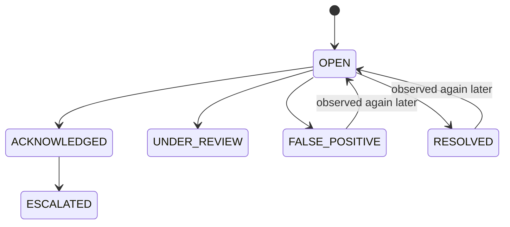
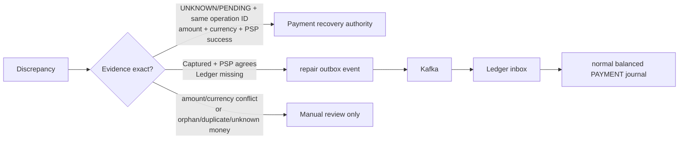
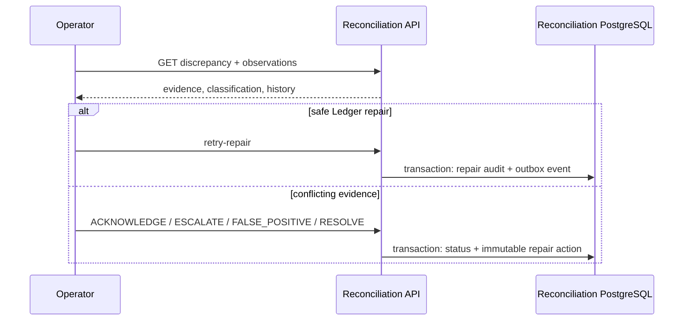

# Batch reconciliation and safe repair

Status: implemented for the focused Payment/PSP/Settlement/Ledger evidence path. PostgreSQL/Redpanda execution still depends on running the opt-in integration environment; unit results do not prove infrastructure behavior.

## What is compared

[`ReconciliationService.reconcileEvidence`](../apps/reconciliation-service/src/reconciliation.service.ts) compares five independently recorded sources, not two tables:

Payment is authoritative for internal workflow state. PSP operations are evidence of what the provider processed. Ledger is authoritative for internal accounting. The statement is evidence of what the provider claims to have settled. No source “always wins”; agreement and stable identities determine what is safe.

The explicit discrepancy types are `PROVIDER_TRANSACTION_MISSING`, `INTERNAL_PAYMENT_MISSING`, `AMOUNT_MISMATCH`, `CURRENCY_MISMATCH`, `STATUS_MISMATCH`, `LEDGER_ENTRY_MISSING`, `LEDGER_AMOUNT_MISMATCH`, `SETTLEMENT_ITEM_MISSING`, `UNKNOWN_SETTLEMENT_ITEM`, `DUPLICATE_SETTLEMENT_ITEM`, `SETTLEMENT_GROSS_MISMATCH`, `SETTLEMENT_FEE_MISMATCH`, `SETTLEMENT_NET_MISMATCH`, `REFUND_MISSING_AT_PROVIDER`, `REFUND_LEDGER_MISSING`, and `STATEMENT_INTEGRITY_FAILED`.

## Durable runs and history

A run has a stable SHA-256 key over provider, batch, window, and source digest. A unique constraint returns the existing run on exact replay. A database lease allows one worker; another worker receives `RUN_LEASE_UNAVAILABLE`. Paged service APIs use stable cursors and bounded page sizes. The current coordinator collects the bounded pages before the pure cross-source match; this is suitable for the learning dataset but an external sort/staging phase is still needed for very large windows.

Discrepancies use a stable fingerprint. Every run adds a `discrepancy_observations` row with expected/actual evidence and digest. Resolving a discrepancy does not delete it. If later evidence disagrees again, status reopens and the original first-detected time, observation count, old evidence, and repair audit remain queryable.

## Timing windows

Reconciliation uses a configurable grace period (`RECONCILIATION_GRACE_MS`, default 30 seconds). A newly captured payment can precede its Kafka-delivered Ledger journal; inside the grace interval it is not flagged `LEDGER_ENTRY_MISSING`. Provider statements use closed `[windowStart, windowEnd)` windows, avoiding an unstable “right now” edge.

## Repair trust boundary

The Payment recovery worker remains the runtime authority for uncertain operations: it queries the known PSP operation identity and uses the normal state transition/outbox transaction. Reconciliation classifies an exact `CAPTURE_UNKNOWN`/`CAPTURE_PENDING` plus PSP success as safe, but does not expose an unauthenticated “force success” API.

A missing capture journal is repaired with `ledger.repair-requested.v1` on `ledgerflow.repairs.v1`; the Reconciliation service never inserts Ledger rows. Ledger claims its inbox and checks the business reference in the same transaction, so delivery twice produces one journal. Amount, currency, orphan-provider, duplicate settlement, unexplained extra money, and statement integrity conflicts always require review.

The operator API requires `x-operator-token` and supports listing runs/discrepancies, `ACKNOWLEDGE`, `MARK_FALSE_POSITIVE`, `ESCALATE`, `RESOLVE`, and the narrowly constrained safe Ledger repair action. It never accepts arbitrary Ledger entries or arbitrary Payment state.

## Retry, recovery, reconciliation, settlement

| Concept | Purpose | May create external/financial effect? |
|---|---|---|
| Retry | Repeat the same operation identity safely | Possibly, protected by idempotency |
| Recovery | Resolve one unfinished/unknown workflow by querying PSP | Uses the original operation and normal Payment transaction |
| Reconciliation | Compare independently recorded evidence after the fact | Detection is read-only; explicit repairs are audited |
| Settlement | Clear PSP obligations into cash/fees after capture | Yes, through outbox → Ledger inbox |

## Failure-first behavior

| Failure | Durable/repeatable behavior |
|---|---|
| Statement persisted, processing not started | Batch/items remain `CREATED`/`PENDING`; start or replay resumes them. |
| Worker crashes halfway | Completed item transactions remain; lease expires; unique run/item/event identities make restart safe. |
| Settlement event published, local bookkeeping not updated | Item remains `POSTING`; Ledger may post; next run observes the journal and marks `SETTLED`. |
| Ledger commits, Kafka acknowledgement lost | Redelivery is absorbed by inbox and business-reference uniqueness. |
| Crash before discrepancy save | Its item transaction rolls back; checkpoint/run remains resumable and the comparison repeats. |
| Repair event delivered twice | Ledger creates one inbox/business journal effect. |
| Statement delivered twice | Same identity+digest returns the existing batch; changed content under the same ID is rejected. |
| Two workers start same run | Unique run key and row lease select one owner. |
| Provider data later changes | New source digest creates a new run/observations; old evidence is retained. |

Structured completion logs include correlation/run/batch IDs, matched/mismatch counts, candidate count, replay flags, and duration can be derived from run timestamps. Database counts provide runs, mismatch types, repair totals, settlement gross/fees/net, and unsettled items without adding Grafana.
