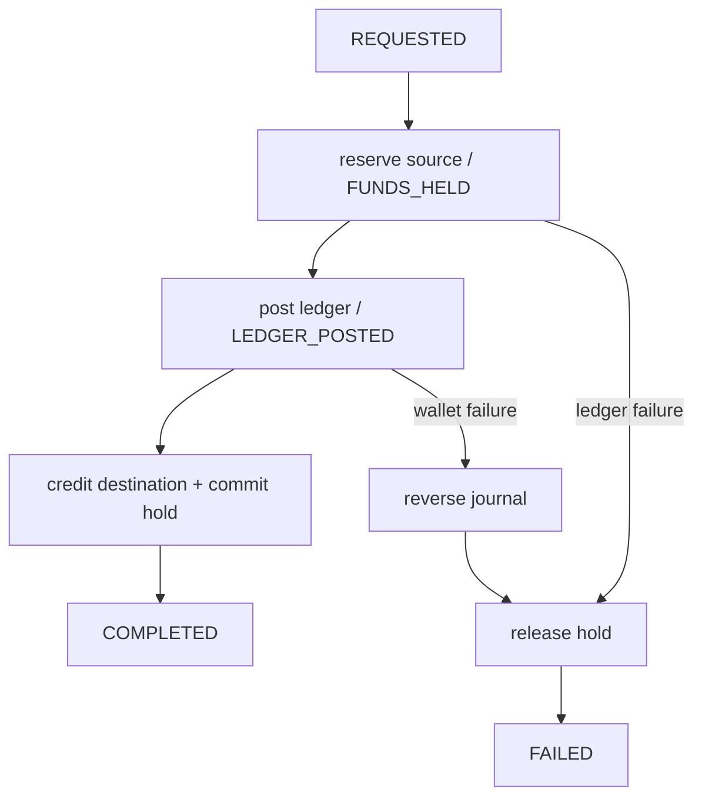

# Saga strategy

Status: transfer orchestration implemented; durable recovery planned.

The transfer workflow uses orchestration in `apps/wallet-service/src/transfer.saga.ts`. A single component records/decides the next step, making compensation and stuck-state inspection explicit. No cross-database transaction or 2PC is used.

Choreography was rejected for this flow because understanding the complete compensation chain would require reconstructing it from several consumers. Orchestration creates coupling to command contracts but gives operators a clear state machine. A durable implementation needs a saga table, optimistic version, next-attempt timestamp, and recovery worker.
