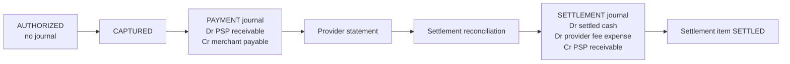
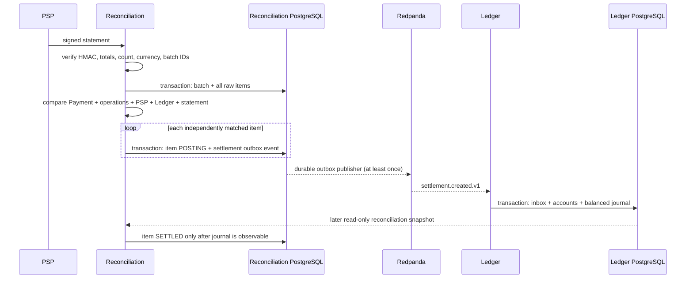
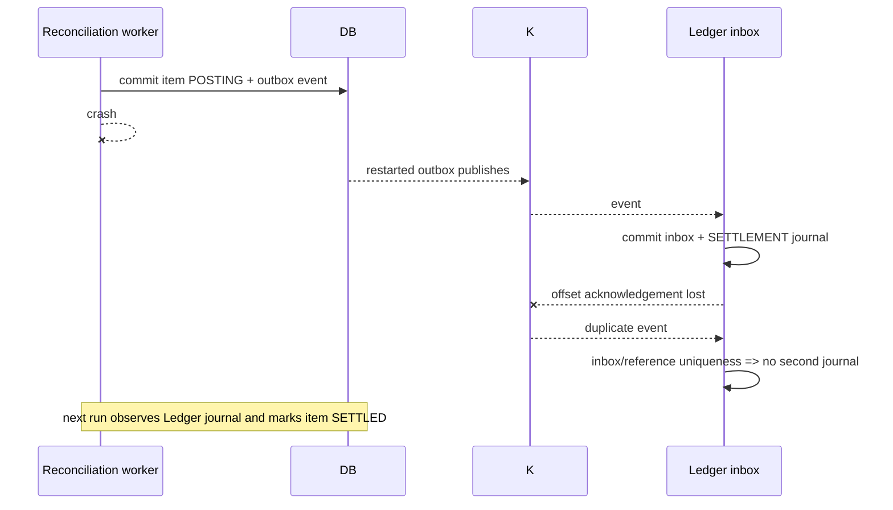

# Settlement

Status: implemented for the focused PSP → Reconciliation → Kafka → Ledger slice.

## Capture is not settlement

### Audited money model

- `payments` is the internal workflow aggregate. Its authorized/captured/refunded minor-unit totals describe confirmed lifecycle outcomes; it is not an account balance.
- `payment_operations` is the durable attempt/identity record for AUTHORIZE, CAPTURE, and REFUND. Its UUID is the PSP idempotency key and reconciliation join key. PENDING/UNKNOWN means outcome uncertainty, not failure.
- `psp_operations` is the simulator's provider-side record. `external_payment_id` groups the provider payment, while `operation_id` uniquely identifies the individual authorize/capture/refund request.
- `webhook_events` is Payment's durable callback inbox. Authenticity is checked before ingestion; event ID and provider sequence handle replay and ordering.
- Payment `outbox_events` is committed with lifecycle changes. Kafka publication can repeat; Ledger absorbs duplicates.
- `ledger_journals`/`ledger_entries` are append-only accounting truth. Account balances are derived from entries; historical capture/refund journals are never edited.
- The current `WalletBook` demonstrates available/pending reservation semantics for transfers, but the Compose Payment→PSP→Ledger slice does not debit a persisted wallet at capture. Reconciliation therefore does not treat Wallet as settlement evidence in this iteration.

Money is authorized when PSP authorization succeeds, captured when the capture operation succeeds, posted internally when Ledger commits its inbox+journal transaction, owed by PSP when the capture debits PSP receivable, owed to the merchant when the same capture credits merchant payable, and settled only when a matched statement item has an observable `SETTLEMENT` journal.

Authorization is a PSP promise that funds are available; it creates no Ledger journal. Capture is the PSP-confirmed financial outcome. `payment.captured.v1` posts a `PAYMENT` journal: debit the PSP receivable/clearing asset and credit the merchant payable liability. The platform is now owed money by the PSP and owes money to the merchant. Posting is the internal accounting record; it is not proof that cash reached a bank account. Settlement is the later provider statement and clearing movement. Merchant payout remains out of scope.

Refunds remain separate append-only `REFUND` journals. A refund statement item clears the negative PSP receivable position by debiting PSP receivable and crediting settled cash. Historical capture/refund journals are never mutated.

## Provider statement

[`settlement-statement.ts`](../apps/psp-simulator/src/settlement-statement.ts) calculates a deterministic 3% provider fee with integer minor units: `fee = floor(gross * 300 / 10_000)`. A USD 10,000 capture therefore has gross 10,000, fee 300, and net 9,700. It supports controlled missing, duplicate, amount, fee, net, status, unknown-item, wrong-batch, and malformed-item scenarios.

Statements contain provider/batch identity, closed time window, currency, item count, gross/fee/net totals, provider transaction and internal references, and an HMAC-SHA256 signature. The PSP persists the exact first result by `providerSettlementId`; replay returns the same document. HMAC proves origin/integrity, not financial correctness—a correctly signed statement can still disagree with Payment or Ledger.

## Durable batch sequence

Batch ingestion is atomic; item financial posting is item-atomic. A malformed or mismatched item is visible without blocking independent valid items. `settlement_items.status` provides the checkpoint (`PENDING → POSTING → SETTLED`), while `MALFORMED`/`MISMATCHED` require review. The same statement cannot create another batch because `(provider, provider_settlement_id)` is unique and the digest must match. A changed document under the same ID is rejected.

## Ledger movement

For a capture settlement:

| Account meaning | Type | Direction | 10,000 example |
|---|---|---:|---:|
| Settled cash/bank (platform owner sentinel `...002`) | ASSET | Debit | 9,700 |
| Provider fee (platform owner sentinel `...003`) | EXPENSE | Debit | 300 |
| PSP receivable/clearing (platform owner sentinel `...001`) | ASSET | Credit | 10,000 |

This clears the receivable created by capture. It does not repeat the capture journal and it does not reduce merchant payable; merchant payout is another future flow. [`settlementEntries`](../apps/ledger-service/src/postgres-ledger.repository.ts) validates gross = net + fee and [`assertBalanced`](../apps/ledger-service/src/ledger.domain.ts) plus the deferred PostgreSQL trigger enforce equal debits and credits.

## Crash/restart timeline

The DB transaction cannot include Kafka or the Ledger database. The reconciliation outbox closes the local DB→Kafka gap, and the Ledger inbox plus unique `(reference_type, reference_id)` closes duplicate-side-effect gaps. Delivery remains at least once, not exactly once.

Key files: [`0002_settlement_and_reconciliation.sql`](../apps/reconciliation-service/migrations/0002_settlement_and_reconciliation.sql), [`reconciliation.store.ts`](../apps/reconciliation-service/src/reconciliation.store.ts), [`outbox.worker.ts`](../apps/reconciliation-service/src/outbox.worker.ts), [`kafka-ledger.consumer.ts`](../apps/ledger-service/src/kafka-ledger.consumer.ts), and [`postgres-ledger.repository.ts`](../apps/ledger-service/src/postgres-ledger.repository.ts).
