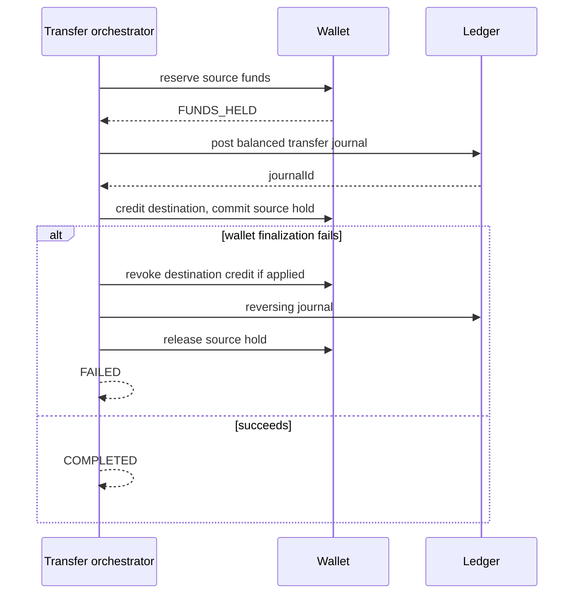

# Transfer flow

Status: current domain implementation.

`TransferSaga` is explicit orchestration because its ordered compensations are easier to study than implicit choreography. Holding changes available and pending balances but not the ledger balance. Posting creates accounting truth. Final wallet projections may briefly lag, which is intentional eventual consistency.

If the orchestrator crashes after ledger posting, persisted saga state and a recovery worker are required to resume or compensate. The current in-memory implementation demonstrates the decisions and tests the pre-ledger compensation, but durable saga recovery is a documented next step.
