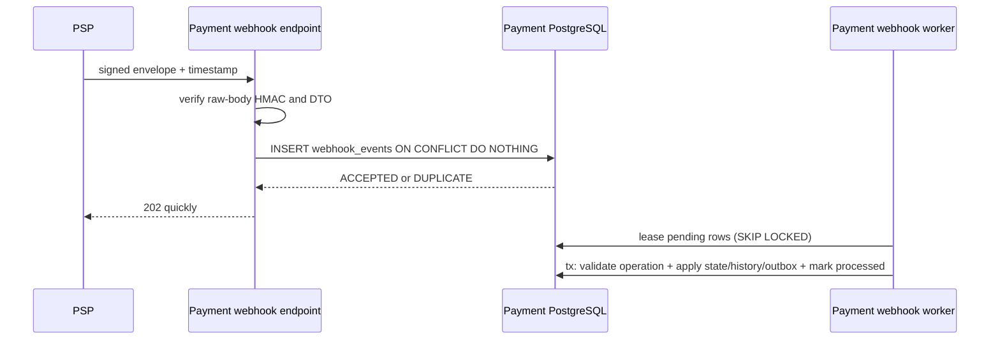
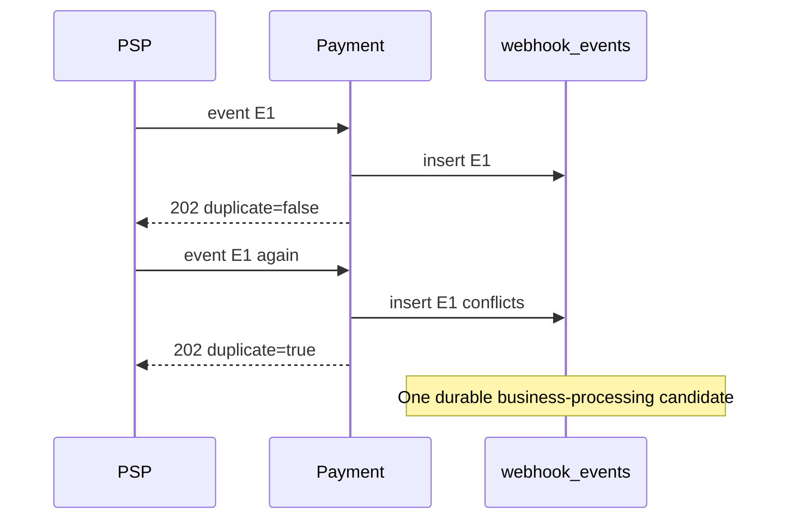

# PSP webhook lifecycle

Status: durable ingestion and asynchronous processing implemented.

## Authenticity and acceptance

The endpoint verifies HMAC-SHA256 over `timestamp.rawBody`, enforces a configurable tolerance (default five minutes), validates a 64-hex signature, and compares bytes in constant time. The shared secret comes from `PSP_WEBHOOK_SECRET`. This proves transport authenticity only. A valid provider event can still be duplicated, stale, out of order, or inconsistent with its operation.



The `webhook_events.event_id` primary key is durable replay protection. It is separate from the Ledger Kafka inbox. A crash after insert but before processing leaves `PENDING`; a restarted worker leases it. A crash during processing rolls the entire transaction back. A crash after commit sees `PROCESSED` on restart.

## Duplicate delivery



## Out-of-order delivery

```mermaid
sequenceDiagram
  participant X as PSP
  participant P as Payment
  X->>P: CAPTURED sequence 20
  P->>P: advance to CAPTURED
  X->>P: late AUTHORIZED sequence 10
  P->>P: compare providerSequence; mark callback IGNORED
  Note over P: Never regress CAPTURED to AUTHORIZED
```

Before applying an event, the worker checks operation ID, payment ID, operation type, amount, currency, expected event kind, and provider sequence. The state machine is the second guard. `CAPTURED + late AUTHORIZED` and `REFUNDED + old CAPTURED` cannot reopen a payment.

The webhook-before-HTTP race is resolved by database row locks and terminal operation status. If webhook processing wins, the later HTTP result returns the current state. If HTTP wins, the callback is stale/duplicate and is ignored. Either order emits at most one effective financial state transition; the downstream Ledger inbox remains the final defense against repeated Kafka facts.

Limitations: malformed but correctly signed events are retained as `IGNORED`, not moved to a separate webhook DLQ; key rotation and per-provider secrets are not implemented; clock synchronization is assumed within the tolerance window.
